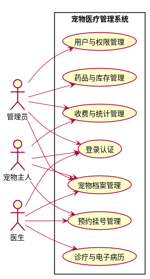
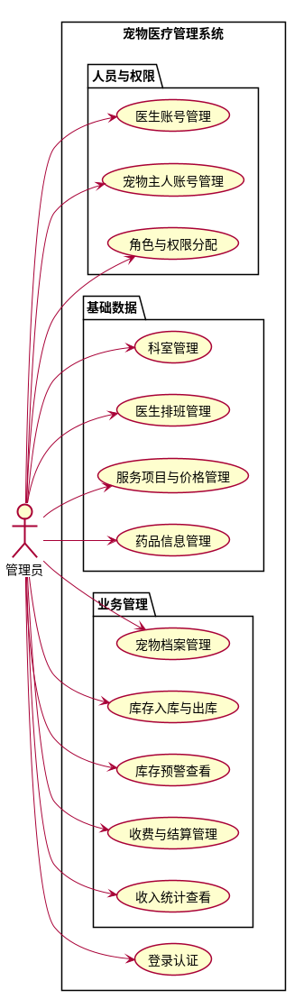
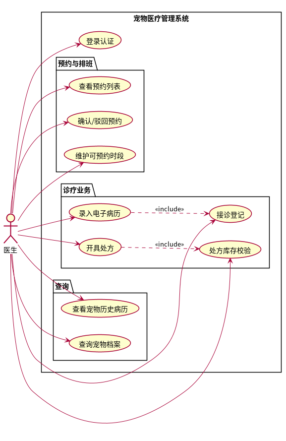
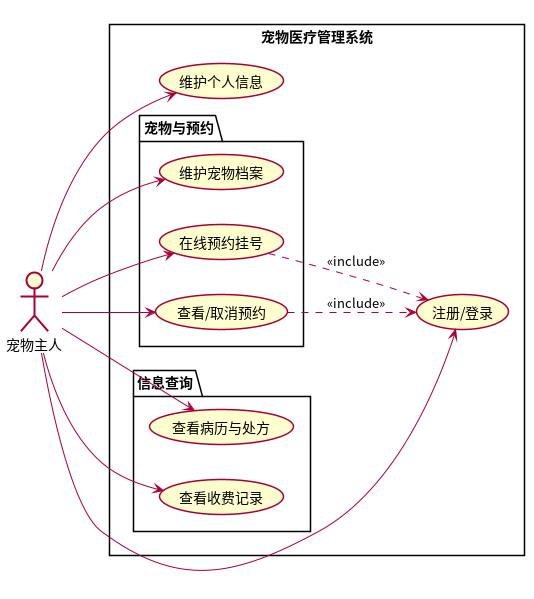
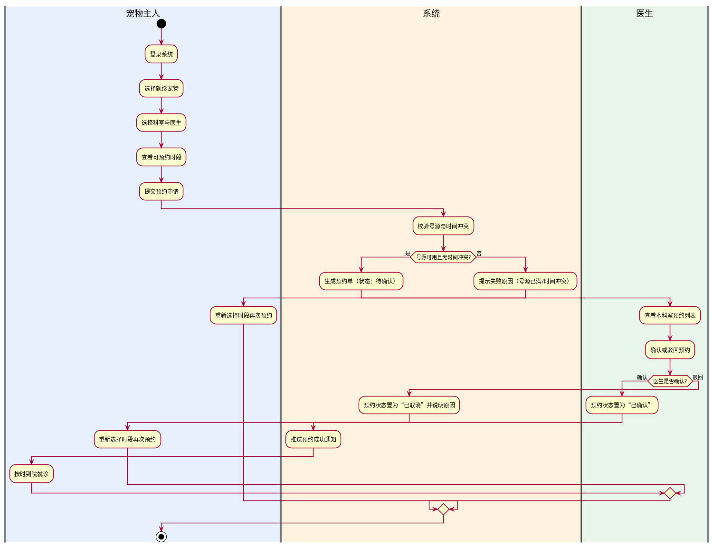
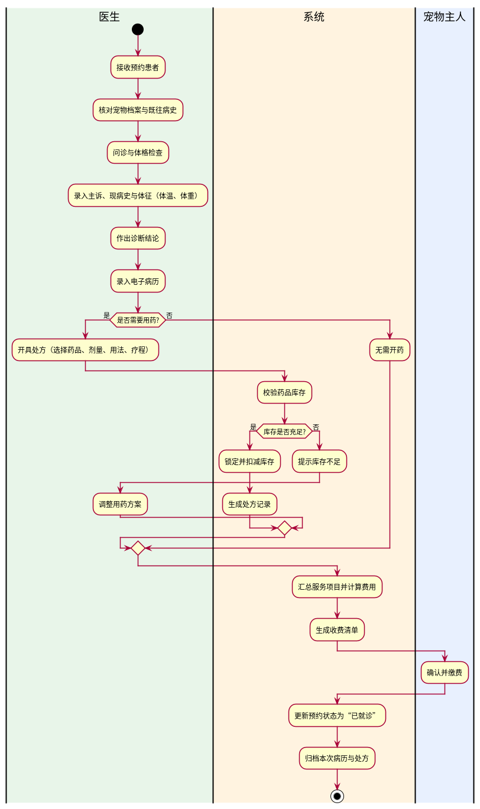

# 宠物医疗管理系统 需求规格说明书

| 项目名称 | 基于 Spring Boot 的宠物医疗管理系统 |
| --- | --- |
| 文档编号 | SRS-PETMED-001 |
| 版本 | v2.0 |
| 编写日期 | 2026-10-05 |
| 对应阶段 | 需求分析 |

**修订记录**

| 版本 | 日期 | 修订说明 | 修订人 |
| --- | --- | --- | --- |
| v1.0 | 2026-10-05 | 首次编写，九模块结构 | ES |
| v2.0 | 2026-10-05 | 功能范围收敛为**六个核心模块**，砍去公告资讯、报表导出、爽约限制、病历更正、用药禁忌查询等非核心功能，聚焦诊疗业务闭环 | ES |

> **本版说明**：相较 v1.0，本版把功能模块由九个合并精简为六个，并**实质削减**了非核心功能。
> 目的是把有限的时间投入到核心业务闭环的深度实现上，而不是广铺功能。
> 被移除的功能及理由见 1.5 节。

---

## 1 引言

### 1.1 编写目的

本文档描述"基于 Spring Boot 的宠物医疗管理系统"的完整需求，明确系统的功能边界、
用户角色、业务流程、非功能指标与数据需求。本文档面向毕业设计指导教师评审、
后续的数据库设计与接口设计，以及论文"需求分析"章节编写。

### 1.2 项目背景

中小型宠物诊疗机构普遍依赖纸质台账或功能单一的单机软件进行管理，存在宠物健康档案
分散、病历难以纵向追溯、预约排班依赖人工、药品库存管理粗放、收费与统计困难、
宠物主人获取诊疗信息不便等问题。本系统旨在构建一套前后端分离、覆盖
"宠物档案—预约挂号—接诊诊疗—处方用药—药品库存—收费统计"核心业务闭环的
信息化管理系统，服务 **管理员、医生、宠物主人** 三类角色。

### 1.3 术语与定义

| 术语 | 含义 |
| --- | --- |
| 宠物档案 | 记录宠物基本信息（种类、品种、性别、出生日期、体重、绝育、过敏史等）的电子档案 |
| 电子病历（EMR） | 一次就诊过程的结构化记录，含主诉、现病史、体格检查、诊断结论等 |
| 处方 | 医生针对诊断结果开具的用药方案，含药品、剂量、用法、疗程 |
| 号源 | 医生在某一时段可供预约的名额 |
| RBAC | 基于角色的访问控制（Role-Based Access Control） |
| 安全库存 | 为避免断货而设定的药品最低库存阈值 |
| 逻辑删除 | 通过标记字段（如 `deleted`）标注删除，数据不物理移除 |

### 1.4 参考资料

1. 《基于 Spring Boot 的宠物医疗管理系统设计与实现》开题报告
2. GB/T 8567—2006 计算机软件文档编制规范
3. IEEE Std 830—1998 软件需求规格说明推荐实践
4. 《中华人民共和国个人信息保护法》《中华人民共和国动物防疫法》
5. Spring Boot、Vue.js、MyBatis-Plus、MySQL 官方文档

### 1.5 范围说明（本版不含）

为聚焦核心业务闭环，以下功能**不在本版范围内**，可在系统稳定后作为后续扩展：

| 暂不实现 | 理由 |
| --- | --- |
| 公告与资讯管理 | 与核心诊疗业务关联度低，属于内容管理而非业务流转 |
| 报表导出（Excel/PDF） | 收入统计以页面图表呈现即可满足需求，导出属增值功能 |
| 爽约次数限制 | 规则较复杂且依赖长期数据积累，对本系统验证价值有限 |
| 病历归档后留痕更正 | 涉及版本留痕机制，实现成本高，本版以"归档后不可改"简化处理 |
| 用药禁忌自动提示 | 需要药品知识库支撑，超出毕设可实现的范围 |
| 短信/消息推送 | 依赖第三方服务与费用，改用站内提示替代 |

---

## 2 总体描述

### 2.1 系统目标

构建一套 B/S 架构的宠物医疗管理系统，实现：

1. 宠物健康档案的电子化、连续化与可追溯；
2. 预约挂号流程线上化，减少排队等待与人工排班；
3. 接诊、病历、处方、收费在同一系统内闭环流转，减少差错；
4. 药品库存的精细化与预警管理，降低短缺与过期损耗；
5. 收费与收入的规范化记录与统计，支撑经营分析；
6. 宠物主人自助服务，提升就医体验与参与度。

### 2.2 用户角色与特征

| 角色 | 描述 | 主要诉求 | 使用频率 |
| --- | --- | --- | --- |
| 管理员 | 医院管理者或前台，负责系统与业务数据的维护 | 高效维护基础数据、掌控经营状况 | 每日 |
| 医生 | 接诊医生 | 快速查看病史、便捷录入病历与处方 | 每日，高频 |
| 宠物主人 | 宠物饲养者 | 便捷预约、随时查询宠物健康信息 | 不定期 |

角色权限遵循最小必要原则：宠物主人只能访问本人名下的宠物与就诊数据；
医生只能查看本人接诊及本科室相关数据；管理员拥有全局管理权限。

### 2.3 运行环境

| 项目 | 要求 |
| --- | --- |
| 服务端 | JDK 17、MySQL 8.0、可用内存 ≥ 2 GB |
| 客户端 | Chrome / Edge 等主流浏览器（近两年版本） |
| 网络 | 内网或公网 HTTP/HTTPS 访问 |
| 分辨率 | 适配 1366×768 及以上，管理端建议 ≥ 1440×900 |

### 2.4 设计约束

1. 必须采用前后端分离架构，后端提供 RESTful 接口；
2. 后端使用 Spring Boot 分层架构（Controller—Service—Mapper）；
3. 数据库使用 MySQL 8.0，表结构满足第三范式；
4. 系统须实现基于 JWT 的身份认证与基于 RBAC 的授权；
5. 用户密码不得明文存储，须采用不可逆加密（BCrypt）；
6. 开发须符合《中华人民共和国个人信息保护法》对个人信息处理的要求。

### 2.5 假设与依赖

1. 假设宠物医院具备稳定的网络与基本的服务器/云主机环境；
2. 假设医生与宠物主人在系统上操作真实、及时；
3. 依赖 MySQL 数据库的可用性；
4. 本课题不涉及真实支付通道对接，收费以线下确认或模拟结算处理。

---

## 3 功能需求

### 3.1 功能结构总览

系统划分为六个功能模块，总体用例关系如图 1 所示。

| 模块编号 | 模块名称 | 主要使用角色 |
| --- | --- | --- |
| M1 | 用户与权限管理 | 管理员 |
| M2 | 宠物档案管理 | 宠物主人、医生、管理员 |
| M3 | 预约挂号管理 | 宠物主人、医生、管理员 |
| M4 | 诊疗与电子病历 | 医生 |
| M5 | 药品与库存管理 | 管理员 |
| M6 | 收费与统计管理 | 管理员、宠物主人 |

需求优先级：**高** 为必做（核心闭环）、**中** 为应做。

### 3.2 M1 用户与权限管理

| 需求编号 | 功能名称 | 需求描述 | 参与者 | 优先级 |
| --- | --- | --- | --- | --- |
| FR-01-01 | 用户注册 | 宠物主人可通过用户名注册账号，填写基本信息 | 宠物主人 | 高 |
| FR-01-02 | 用户登录 | 三类角色凭账号密码登录，服务端签发 JWT 令牌 | 全部 | 高 |
| FR-01-03 | 账号管理 | 管理员可新增、启用/禁用、重置医生与宠物主人账号 | 管理员 | 高 |
| FR-01-04 | 角色与权限分配 | 管理员为用户分配角色，系统按角色控制接口与菜单访问 | 管理员 | 高 |
| FR-01-05 | 个人信息维护 | 用户可查看并修改本人基本信息与密码 | 全部 | 中 |

**业务规则**

- BR-01-01：用户名全局唯一，注册时校验重复。
- BR-01-02：密码长度不少于 8 位，须包含字母与数字，存储为 BCrypt 密文。
- BR-01-03：被禁用账号登录时提示"账号已停用"，不得暴露账号是否存在。

### 3.3 M2 宠物档案管理

| 需求编号 | 功能名称 | 需求描述 | 参与者 | 优先级 |
| --- | --- | --- | --- | --- |
| FR-02-01 | 新增宠物档案 | 录入昵称、种类、品种、性别、出生日期、体重、绝育、过敏史等 | 宠物主人、管理员 | 高 |
| FR-02-02 | 修改/删除档案 | 修改宠物信息；删除采用逻辑删除，保留历史就诊数据 | 宠物主人、管理员 | 高 |
| FR-02-03 | 查询档案 | 按宠物编号/名称/主人/种类检索，支持分页 | 宠物主人、医生、管理员 | 高 |
| FR-02-04 | 健康记录维护 | 维护疫苗、驱虫等预防保健记录 | 宠物主人、医生 | 中 |
| FR-02-05 | 历史就诊查询 | 按宠物纵向查看历次就诊记录、病历与处方 | 宠物主人、医生 | 高 |

**业务规则**

- BR-02-01：宠物主人仅能操作本人名下宠物；医生只能查看、不能修改主人自建档案。
- BR-02-02：宠物编号系统自动生成且全局唯一；体重、出生日期须为合法值。
- BR-02-03：存在未完成预约或未结清费用的宠物，不允许删除。

### 3.4 M3 预约挂号管理

| 需求编号 | 功能名称 | 需求描述 | 参与者 | 优先级 |
| --- | --- | --- | --- | --- |
| FR-03-01 | 科室与医生查询 | 按科室查看医生列表及其简介、专长 | 宠物主人 | 高 |
| FR-03-02 | 号源查询 | 查看医生某日各时段的可预约号源余量 | 宠物主人 | 高 |
| FR-03-03 | 提交预约 | 选择宠物、科室、医生、时段提交预约 | 宠物主人 | 高 |
| FR-03-04 | 预约审核 | 医生查看本科室预约列表，确认或驳回 | 医生 | 高 |
| FR-03-05 | 取消预约 | 宠物主人或医生可取消预约并填写原因 | 宠物主人、医生 | 高 |
| FR-03-06 | 排班维护 | 管理员维护科室与医生可预约时段 | 管理员 | 中 |

预约状态流转：**待确认 → 已确认 → 已就诊**；分支状态为 **已取消**。

**业务规则**

- BR-03-01：同一宠物在同一时段不可重复预约。
- BR-03-02：提交预约时须实时校验号源余量，采用乐观锁/唯一约束防止超订。
- BR-03-03：宠物主人须在预约时段开始前 2 小时取消，逾期记爽约（本版不做次数限制）。
- BR-03-04：号源余量不足时拒绝预约并提示原因。

### 3.5 M4 诊疗与电子病历

| 需求编号 | 功能名称 | 需求描述 | 参与者 | 优先级 |
| --- | --- | --- | --- | --- |
| FR-04-01 | 接诊登记 | 医生对已确认预约的宠物发起接诊，生成就诊记录 | 医生 | 高 |
| FR-04-02 | 录入病历 | 录入主诉、现病史、体格检查、体温、体重、诊断结论 | 医生 | 高 |
| FR-04-03 | 开具处方 | 选择药品并填写剂量、用法、疗程，生成处方 | 医生 | 高 |
| FR-04-04 | 处方库存校验 | 开具处方时校验药品库存，不足则提示 | 系统 | 高 |
| FR-04-05 | 病历与处方查询 | 医生查询历史病历；宠物主人查看本人宠物的病历与处方 | 医生、宠物主人 | 高 |

**业务规则**

- BR-04-01：病历一旦归档不可修改或删除（本版不做留痕更正）。
- BR-04-02：体温、体重等体征须做合理区间校验。
- BR-04-03：处方须关联具体病历与宠物，至少包含一种药品，剂量与疗程须为正数。
- BR-04-04：处方确认后自动扣减库存并生成出库记录。

### 3.6 M5 药品与库存管理

| 需求编号 | 功能名称 | 需求描述 | 参与者 | 优先级 |
| --- | --- | --- | --- | --- |
| FR-05-01 | 药品信息维护 | 维护名称、规格、单位、进价/售价、生产厂家、有效期等 | 管理员 | 高 |
| FR-05-02 | 药品入库 | 登记入库数量、批次、进价并增加库存 | 管理员 | 高 |
| FR-05-03 | 药品出库 | 处方领药自动扣减；支持手工出库（报废、调拨） | 管理员、系统 | 高 |
| FR-05-04 | 库存预警 | 低于安全库存或临近有效期的药品列表提醒 | 管理员 | 中 |

**业务规则**

- BR-05-01：库存数量不可为负，扣减失败须回滚整笔业务。
- BR-05-02：低于安全库存即触发提醒；有效期不足 30 天标记为近效期。
- BR-05-03：入库、出库均需记录操作人与时间，形成可追溯流水。

### 3.7 M6 收费与统计管理

| 需求编号 | 功能名称 | 需求描述 | 参与者 | 优先级 |
| --- | --- | --- | --- | --- |
| FR-06-01 | 服务项目维护 | 维护服务项目（挂号、诊疗、化验、手术等）及价格 | 管理员 | 高 |
| FR-06-02 | 费用计算 | 依据处方明细与服务项目自动汇总费用 | 系统 | 高 |
| FR-06-03 | 收费结算 | 生成收费清单，记录结算方式与状态 | 管理员 | 高 |
| FR-06-04 | 收入统计 | 按日/月统计收费金额，以图表形式展示 | 管理员 | 中 |

**业务规则**

- BR-06-01：金额以"分"为最小单位存储，避免浮点误差；展示保留两位小数。
- BR-06-02：收费清单生成后金额不可直接修改，须作废重开。
- BR-06-03：未结算的收费单不得标记就诊完成。

### 3.8 各角色用例图

管理员用例见图 2，医生用例见图 3，宠物主人用例见图 4。

### 3.9 关键用例描述

#### UC-01 在线预约挂号

| 项目 | 内容 |
| --- | --- |
| 用例编号 | UC-01 |
| 用例名称 | 在线预约挂号 |
| 参与者 | 宠物主人 |
| 前置条件 | 宠物主人已登录，且名下存在至少一只宠物档案 |
| 后置条件 | 生成状态为"待确认"的预约单，占用相应号源 |
| 基本流程 | 1. 选择就诊宠物；2. 选择科室与医生；3. 查看可预约时段与余量；4. 选择时段并提交；5. 系统校验号源与冲突；6. 生成预约单并推送给医生 |
| 备选流程 | 5a. 号源已满或时间冲突：提示原因，返回步骤 3 重新选择 |
| 异常流程 | 5b. 提交过程中号源被他人占用：提示"该时段已被约满"，返回步骤 3 |
| 业务规则 | BR-03-01、BR-03-02、BR-03-04 |

#### UC-02 接诊并开具处方

| 项目 | 内容 |
| --- | --- |
| 用例编号 | UC-02 |
| 用例名称 | 接诊并开具处方 |
| 参与者 | 医生 |
| 前置条件 | 存在状态为"已确认"的预约；医生已登录 |
| 后置条件 | 生成电子病历与处方记录，扣减相应药品库存，生成收费清单 |
| 基本流程 | 1. 医生接诊，核对宠物档案与既往病史；2. 问诊与体格检查；3. 录入病历；4. 开具处方；5. 系统校验库存；6. 扣减库存；7. 生成收费清单 |
| 备选流程 | 5a. 库存不足：提示并允许医生调整用药方案 |
| 异常流程 | 6a. 库存扣减失败：回滚本次处方，提示重试 |
| 业务规则 | BR-04-01、BR-04-03、BR-04-04、BR-05-01 |

### 3.10 业务流程图

在线预约业务流程见图 5，接诊诊疗业务流程见图 6。

---

## 4 非功能需求

| 编号 | 类别 | 需求描述 | 验收标准 |
| --- | --- | --- | --- |
| NFR-01 | 性能 | 常用查询接口响应时间 | 95% 请求 < 2 秒；列表接口分页，单页 ≤ 20 条 |
| NFR-02 | 并发 | 支持同时在线的用户规模 | ≥ 100 并发用户，无明显卡顿或数据错乱 |
| NFR-03 | 安全 | 身份认证与授权 | JWT 认证、RBAC 授权，越权访问返回 403 |
| NFR-04 | 安全 | 密码与敏感数据保护 | 密码 BCrypt 存储；日志与响应中不出现密码、令牌 |
| NFR-05 | 安全 | 常见攻击防护 | 防 SQL 注入（参数化查询）、防 XSS、关键操作防重复提交 |
| NFR-06 | 可用性 | 界面与交互 | 表单校验即时提示；危险操作二次确认；错误提示明确不含堆栈 |
| NFR-07 | 可靠性 | 数据一致性 | 关键业务（预约、处方、收费）在事务内完成，异常自动回滚 |
| NFR-08 | 可靠性 | 容错与恢复 | 统一异常处理，服务重启后数据不丢失，支持数据备份 |
| NFR-09 | 可维护性 | 代码结构与规范 | 分层清晰、命名规范、关键逻辑有注释，符合项目文件策略 |
| NFR-10 | 兼容性 | 浏览器与数据库 | 支持 Chrome/Edge 近两年版本；MySQL 8.0 |

---

## 5 数据需求

### 5.1 主要实体

| 实体 | 说明 | 关键属性 |
| --- | --- | --- |
| 用户 | 三类角色的账号 | 用户名、密码、真实姓名、手机号、角色、状态 |
| 角色 | 权限集合 | 角色标识、角色名称、权限项 |
| 宠物 | 宠物档案 | 宠物编号、昵称、种类、品种、性别、出生日期、体重、过敏史、主人 |
| 排班 | 医生可预约时段 | 医生、日期、时段、号源总数、已约数 |
| 预约单 | 预约记录 | 宠物、医生、时段、状态、原因 |
| 病历 | 一次就诊记录 | 预约、主诉、现病史、体格检查、体温、体重、诊断、医生、时间 |
| 处方 | 用药方案 | 病历、宠物、医生、金额、状态 |
| 处方明细 | 处方中的药品行 | 处方、药品、数量、剂量、用法、疗程 |
| 药品 | 药品基础信息 | 名称、规格、单位、进价、售价、库存、安全库存、有效期、厂家 |
| 出入库记录 | 库存流水 | 药品、类型（入/出）、数量、批次、操作人、时间 |
| 服务项目 | 收费项目定义 | 项目名称、单价、类别 |
| 收费单 | 一次就诊结算 | 宠物、关联病历、金额、结算方式、状态 |
| 收费明细 | 收费单中的项目行 | 收费单、项目名称、单价、数量 |

### 5.2 实体关系概览

- 一名宠物主人（用户）拥有多只宠物；一只宠物属于一名主人（1:N）。
- 一只宠物可产生多次预约、多份病历（1:N）。
- 一次预约对应一次就诊、一份病历（1:1）。
- 一份病历对应 0 或 1 份处方；一份处方含多条处方明细（1:N）。
- 一份病历对应一份收费单；一份收费单含多条收费明细（1:N）。
- 一名医生可维护多段排班、接诊多次（1:N）。
- 药品与出入库记录为 1:N；处方明细与药品为 N:1。

> 完整的数据字典、字段类型、索引与外键约束在《数据库设计说明书》
> （`docs/03-系统设计/`）中给出。

---

## 6 需求优先级汇总

| 优先级 | 需求编号 | 说明 |
| --- | --- | --- |
| 高（必做） | FR-01-01~04、FR-02-01~03/05、FR-03-01~05、FR-04-01~05、FR-05-01~03、FR-06-01~03 | 构成系统核心业务闭环 |
| 中（应做） | FR-01-05、FR-02-04、FR-03-06、FR-05-04、FR-06-04 | 完善体验与管理能力 |

---

## 7 需求追溯矩阵

| 需求模块 | 主要用例 | 对应论文章节 |
| --- | --- | --- |
| M1 用户与权限 | 登录认证、账号管理 | 第 3 章 需求分析、第 5 章 系统实现 |
| M2 宠物档案 | 宠物档案管理 | 第 3 章、第 4 章 数据库设计 |
| M3 预约挂号 | 在线预约挂号（UC-01） | 第 3 章、第 5 章 |
| M4 诊疗与病历 | 接诊并开具处方（UC-02） | 第 3 章、第 4 章、第 5 章 |
| M5 药品与库存 | 库存入库与出库 | 第 4 章、第 5 章 |
| M6 收费与统计 | 收费结算与收入统计 | 第 4 章、第 5 章、第 6 章 系统测试 |

---

**本文档的下一步**：据此编写《数据库设计说明书》与《接口设计文档》
（均在 `docs/03-系统设计/`），再进入编码实现。
